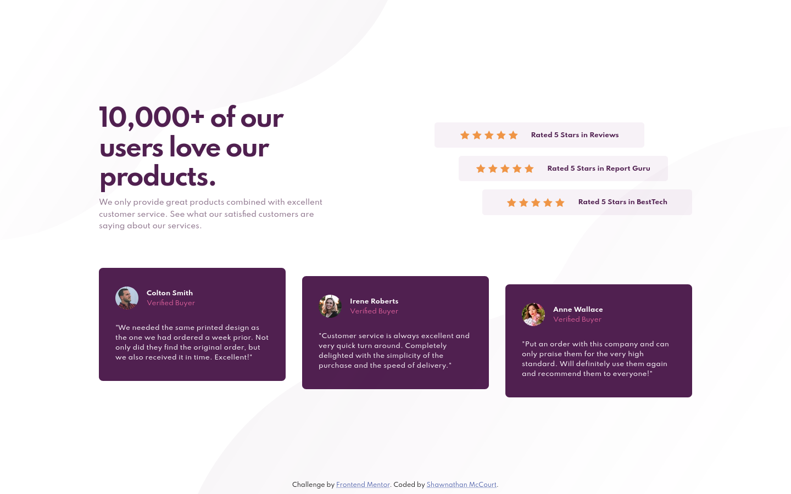

# Frontend Mentor - Social proof section solution

This is a solution to the [Social proof section challenge on Frontend Mentor](https://www.frontendmentor.io/challenges/social-proof-section-6e0qTv_bA). Frontend Mentor challenges help you improve your coding skills by building realistic projects.

## Table of contents

-   [Overview](#overview)
    -   [The challenge](#the-challenge)
    -   [Screenshot](#screenshot)
    -   [Links](#links)
-   [My process](#my-process)
    -   [Built with](#built-with)
    -   [What I learned](#what-i-learned)
    -   [Continued development](#continued-development)
    -   [Useful resources](#useful-resources)
-   [Author](#author)
-   [Acknowledgments](#acknowledgments)

**Note: Delete this note and update the table of contents based on what sections you keep.**

## Overview

### The challenge

Users should be able to:

-   View the optimal layout for the section depending on their device's screen size

### Screenshot

### Links

-   Solution URL: [Add solution URL here](https://your-solution-url.com)
-   Live Site URL: [Add live site URL here](https://your-live-site-url.com)

## My process

### Built with

-   Semantic HTML5 markup
-   Flexbox
-   CSS
-   Mobile-first workflow

### Continued development

I had a tough time with the paragraph text. Not sure how to fix it. I feel that it is hard to figure out font-size based on images alone. I would have a muc heasier time replicating if at least given the correct font sizes and then I can correct things with padding and such.

## Author

-   Frontend Mentor - [@smccourtb](https://www.frontendmentor.io/profile/smccourtb)
